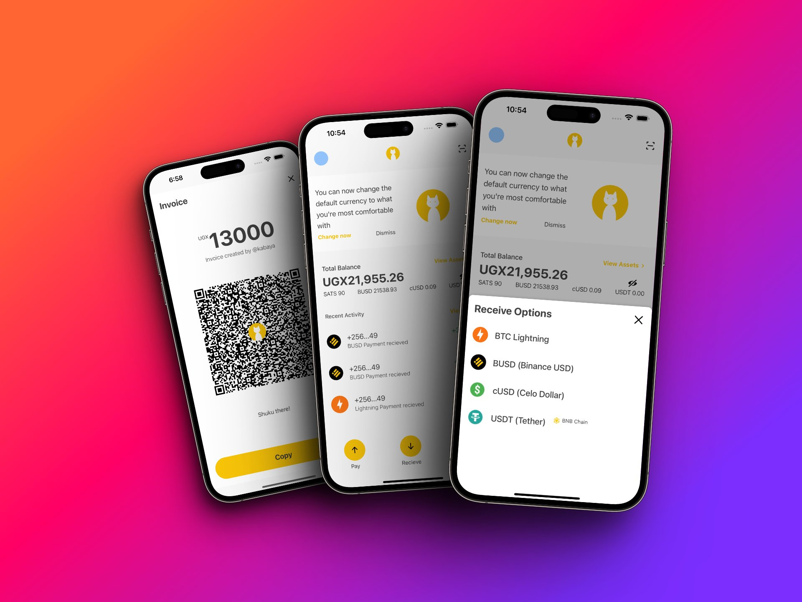

# SHUKURU WALLET
---

https://github.com/eliashezron/BWC_TokenizedCarbon/assets/60871378/fe681aa2-3c9e-40e7-8d48-77e606774cc9

---

## Project Description
Welcome to Shukuru Wallet, a cutting-edge NFC-powered payment application that revolutionizes the way users make cryptocurrency payments. This application enables seamless and secure transactions using NFC cards, providing users with a convenient and efficient payment experience. Shukuru Wallet focuses on facilitating crypto payments denominated in local currencies, ensuring fast and instant transactions.

As a custodial wallet, Shukuru Wallet offers a secure storage solution for users' cryptocurrencies, providing peace of mind and easy accessibility to their digital assets.

Shukuru Wallet is built on the Binance Smart Chain (BSC). The application is designed to support a wide range of cryptocurrencies, including BUSD, BTC, CUSD and BUSD. Introducing a new and innovative way to make transactions.

---

---
## Usecases
1. **Crypto Payments with NFC Cards**: Shukuru Wallet introduces the use of NFC cards for crypto payments. Users can easily tap their NFC cards on NFC-enabled devices to initiate transactions, simplifying the payment process.

2. **Point of Sale Crypto Payments**: Shukuru Wallet is designed to enable crypto payments at point of sale (POS) terminals. Users can conveniently make purchases at participating merchants by tapping their NFC cards on NFC-enabled payment terminals.

## How It Works

1. **Account Creation**: Users start by creating an account on Shukuru Wallet. They provide necessary information and complete the verification process to ensure the security of their transactions.

2. **NFC Card Integration**: Once the account is set up, users can link their NFC cards to their Shukuru Wallet accounts. The cards are uniquely generated for each user and securely stored within the application.

3. **Loading Funds**: Users can load their Shukuru Wallet accounts with cryptocurrencies, either through direct deposits or by converting from other digital assets.

4. **NFC-Powered Payments**: With funds loaded, users can initiate payments by tapping their NFC cards on NFC-enabled devices or payment terminals. The transaction details are securely transmitted and processed in real-time.

5. **Instant Settlement**: Shukuru Wallet ensures fast and instant settlement of transactions, providing a seamless payment experience for both users and merchants.

## Next Steps
Shukuru Wallet is committed to constant improvement and expansion to meet the evolving needs of its users. Our next steps include:

1. **Integration with More Cryptocurrencies**: We plan to add support for a wider range of cryptocurrencies, giving users greater flexibility in making payments.

2. **Merchant Partnerships**: We aim to establish partnerships with more merchants, expanding the availability of NFC-enabled payment terminals and increasing the acceptance of crypto payments through Shukuru Wallet.

3. **Enhanced Security Features**: We are is continuously working on enhancing the security features of the application, ensuring the safety of users' funds and personal information.

4. **User Feedback and Support**: We highly value user feedback and actively seek suggestions for improving Shukuru Wallet.

Join us on the journey to transform the way we make crypto payments with Shukuru Wallet. Experience the speed, convenience, and security of NFC-powered transactions.